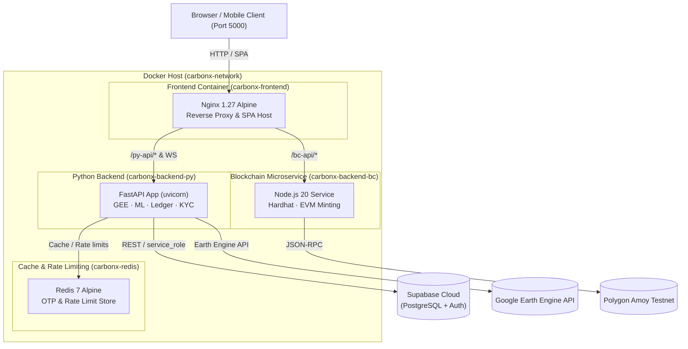

# CarbonX DevOps & Container Architecture

Comprehensive guide to containerization, orchestration, continuous integration, and production operations for the CarbonX platform.

---

## 1. Architecture & Service Topology

CarbonX is architected as a containerized microservice suite connected via an isolated Docker bridge network (`carbonx-network`):



### Services Summary

| Service | Container Name | Base Image | Port | Health Check | Role |
| :--- | :--- | :--- | :--- | :--- | :--- |
| **frontend** | `carbonx-frontend` | `nginx:1.27-alpine` | `5000:80` | `GET /healthz` | Serves compiled React SPA, proxies `/py-api/` and `/bc-api/` |
| **backend-py** | `carbonx-backend-py` | `python:3.11-slim` | `8000:8000` | `GET /health` | FastAPI REST API, MRV engine, tamper-proof ledger, OTP auth |
| **backend-bc** | `carbonx-backend-bc` | `node:20-alpine` | `3001:3001` | `GET /health` | Smart contract integration, token minting, on-chain verification |
| **redis** | `carbonx-redis` | `redis:7-alpine` | `6379:6379` | `redis-cli ping` | Distributed OTP storage, rate limiting, and session caching |

---

## 2. Container Specifications

### Frontend (`Dockerfile` & `nginx.conf`)
- **Multi-Stage Build**:
  - `builder`: Uses `node:20-alpine` to install dependencies and run `npm run build`.
  - `runner`: Uses unprivileged `nginx:1.27-alpine` to serve production static assets with gzip compression.
- **Reverse Proxy Routing**:
  - `/py-api/*` → `http://backend-py:8000/` (supports WebSocket connection upgrades for real-time ledger streaming).
  - `/bc-api/*` → `http://backend-bc:3001/` for blockchain microservice endpoints.
  - SPA fallback: `try_files $uri $uri/ /index.html;` ensures React Router deep-linking functions cleanly.
- **Security Headers**: Injected at proxy level (`X-Content-Type-Options: nosniff`, `X-Frame-Options: SAMEORIGIN`, `X-XSS-Protection: 1; mode=block`).

### Python Backend (`backend/Dockerfile`)
- **Base Image**: `python:3.11-slim` with `curl` (for healthchecks) and `tesseract-ocr` (for Pahani & document parsing).
- **Security**: Runs under an unprivileged user (`appuser:10001`), preventing container breakout vulnerabilities.
- **Performance**: Pre-compiled Python byte-code, layer caching on `requirements.txt`, and production Uvicorn worker settings.
- **Data Persistence**: Mounts `/app/data` to named volume `carbonx_ledger_data` to ensure the SHA-256 tamper-proof ledger persists across container restarts.

### Node.js Blockchain Microservice (`backend/Dockerfile.node`)
- **Base Image**: `node:20-alpine`.
- **Security**: Runs under the default unprivileged `node` user.
- **Build Context**: Copies compiled artifacts from `blockchain/artifacts` into the runtime container so ABI definitions match deployed contracts.

---

## 3. Orchestration & Commands

Management commands are unified across **Makefile**, **PowerShell** (Windows), and **Bash** (Linux/macOS).

### Command Matrix

| Action | Makefile | Windows (PowerShell) | Linux / macOS (Bash) | Native Docker Compose |
| :--- | :--- | :--- | :--- | :--- |
| **Build images** | `make build` | `.\scripts\devops.ps1 build` | `./scripts/devops.sh build` | `docker compose build` |
| **Start production** | `make up` | `.\scripts\devops.ps1 up` | `./scripts/devops.sh up` | `docker compose up -d` |
| **Stop production** | `make down` | `.\scripts\devops.ps1 down` | `./scripts/devops.sh down` | `docker compose down` |
| **Start development** | `make dev` | `.\scripts\devops.ps1 dev` | `./scripts/devops.sh dev` | `docker compose -f docker-compose.dev.yml up -d` |
| **Stop development** | `make down-dev`| `.\scripts\devops.ps1 down-dev`| `./scripts/devops.sh down-dev` | `docker compose -f docker-compose.dev.yml down` |
| **View logs** | `make logs` | `.\scripts\devops.ps1 logs` | `./scripts/devops.sh logs` | `docker compose logs -f` |
| **Container status** | `make ps` | `.\scripts\devops.ps1 ps` | `./scripts/devops.sh ps` | `docker compose ps` |
| **Run tests** | `make test` | `.\scripts\devops.ps1 test` | `./scripts/devops.sh test` | `docker compose run --rm backend-py python -m unittest discover tests` |
| **Clean volumes** | `make clean` | `.\scripts\devops.ps1 clean` | `./scripts/devops.sh clean` | `docker compose down -v --remove-orphans` |

---

## 4. Development with Hot-Reloading

For local development where source files need to reflect changes immediately:

```bash
# Start dev stack
make dev
# or
./scripts/devops.sh dev
# or on Windows
.\scripts\devops.ps1 dev
```

### What happens in Dev Mode (`docker-compose.dev.yml`):
1. **Frontend**: Mounts project root into `node:20-alpine`, runs Vite with host binding (`--host 0.0.0.0`) on port `5000` with instant HMR. An isolated `node_modules` volume prevents cross-platform file locking.
2. **FastAPI**: Binds `./backend` into `/app` and runs `uvicorn app.main:app --reload` on port `8000`.
3. **Blockchain**: Binds `./backend/src` and `./blockchain/artifacts` into the container.
4. **Redis**: Persistent data stored in `carbonx_redis_data_dev`.

---

## 5. Continuous Integration (CI/CD)

The repository includes automated GitHub Actions pipelines located in `.github/workflows/`:

1. **`ci.yml`**:
   - Runs on every push to `main` and pull request.
   - Frontend: ESLint verification and Vite production build.
   - Backend: Python 3.11 hermetic test suite (68 tests covering ledger, credit math, stage-1 crop verification, and voice AI).
2. **`docker-build.yml`**:
   - Validates compose configurations (`docker compose config`).
   - Builds all three multi-stage Docker images with GitHub Actions layer caching (`type=gha`).
3. **`monitor.yml`**:
   - Triggers the 5-day satellite monitoring cycle against deployed endpoints.

---

## 6. Production Deployment Guides

### Option A: Cloud Run (GCP) or AWS ECS (Fargate)
1. Build and tag the images:
   ```bash
   docker tag carbonx-frontend:latest gcr.io/<PROJECT_ID>/carbonx-frontend:latest
   docker tag carbonx-backend-py:latest gcr.io/<PROJECT_ID>/carbonx-backend-py:latest
   docker tag carbonx-backend-bc:latest gcr.io/<PROJECT_ID>/carbonx-backend-bc:latest
   ```
2. Push to Container Registry / Artifact Registry:
   ```bash
   docker push gcr.io/<PROJECT_ID>/carbonx-frontend:latest
   docker push gcr.io/<PROJECT_ID>/carbonx-backend-py:latest
   docker push gcr.io/<PROJECT_ID>/carbonx-backend-bc:latest
   ```
3. Set environment variables on the container services:
   - `SUPABASE_URL` & `SUPABASE_SERVICE_ROLE_KEY`
   - `JWT_SECRET_KEY`
   - `REDIS_URL` (e.g. AWS ElastiCache or GCP Memorystore)
   - `CORS_ORIGINS`

### Option B: Kubernetes (K8s)
- Use standard Deployment manifests with 2+ replicas for `frontend` and `backend-py`.
- Configure `PersistentVolumeClaim` (PVC) for `carbonx_ledger_data` if running standalone, or configure Supabase storage for ledger records (`CARBONX_LEDGER_STORAGE=supabase`).
- Configure Ingress with cert-manager for automatic TLS termination.
- Set Liveness / Readiness probes pointing to `/health` on port 8000 and `/healthz` on port 80.

---

## 7. Security Best Practices

1. **Non-Root Execution**: Containers do not run as root. Both `appuser` (UID 10001) in Python and `node` (UID 1000) in Node are enforced.
2. **Secret Management**: Passwords, JWT secrets, and API keys are never baked into Docker images. Use Docker environment variables or secret managers (AWS Secrets Manager, GCP Secret Manager, Vault).
3. **Ephemeral Storage**: All application state resides in Supabase, Redis, or named Docker volumes (`carbonx_ledger_data`).
4. **Network Isolation**: Only port 5000 (Frontend) needs public ingress in production. Backend and Redis can remain private within an internal VPC.
